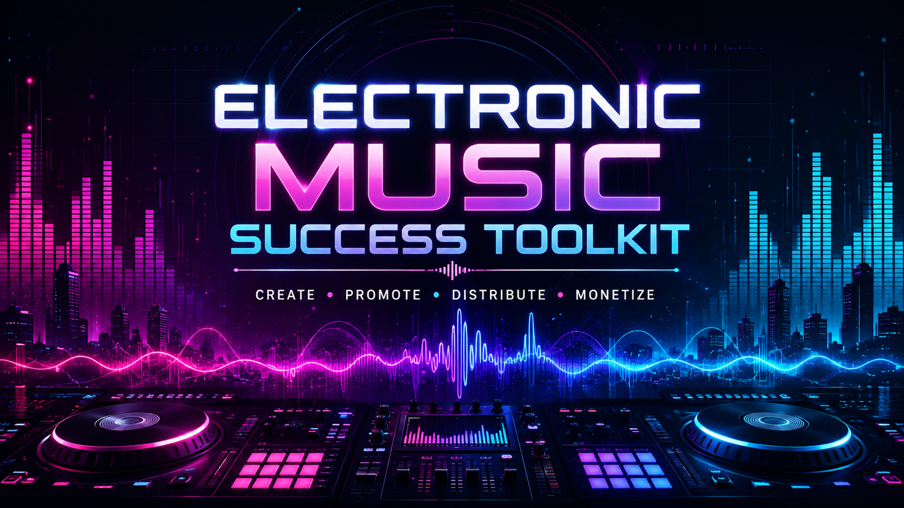
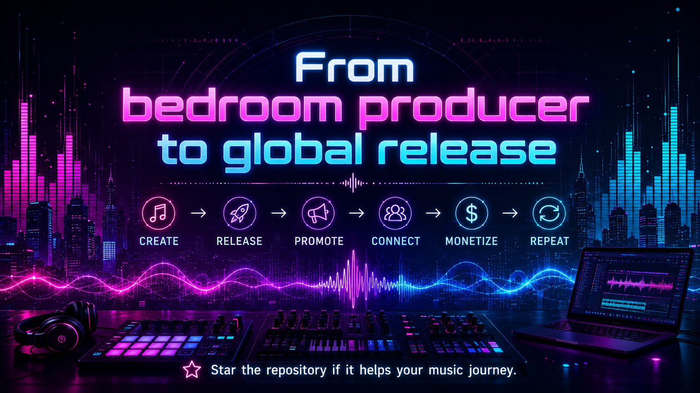

---

## 🎚️ Toolkit Map

| Area | What it helps with |
|---|---|
| 🤖 **AI Music Making** | Generate ideas, tracks, and AI-assisted music workflows. |
| 🎬 **AI Music Video** | Turn songs into visual content and music videos. |
| 🎧 **DJ Sets** | Publish and share mixes, live sets, and DJ sessions. |
| 🚀 **Music Distribution** | Release music to major streaming platforms and stores. |
| 💸 **Music Selling** | Sell beats, services, and creative work online. |
| 📱 **Social Media** | Build reach through short-form and video-first content. |
| 📣 **Music Promotion** | Submit tracks to curators, playlists, and discovery platforms. |
| 💿 **Royalty Collectors** | Collect performance, neighboring-rights, and publishing revenue. |
| 👕 **Merchandise** | Launch print-on-demand artist merchandise. |
| 🌐 **Website** | Build a simple artist hub and online presence. |

---

## 🤖 AI Music Making

> Create music faster with AI-powered generation, experimentation, and production tools.

- **[Suno](https://suno.com)** — Generate complete songs and music ideas from text prompts.
- **[Suno Wiki](https://sunoaiwiki.com/)** — Community knowledge base for Suno prompting and workflows.
- **[Claude AI Music Skills](https://github.com/bitwize-music-studio/claude-ai-music-skills)** — Reusable AI skills and workflows focused on music creation.

---

## 🎬 AI Music Video

> Create visual companions for tracks, releases, teasers, and social media campaigns.

- **[SnapGen](https://snapgen.ai/)** — AI-assisted visual generation for creative content.
- **[Google Flow](https://labs.google/fx/it/tools/flow)** — AI filmmaking and visual storytelling workspace from Google Labs.
- **[Vibes](https://vibes.ai/)** — AI-powered creative tooling for music-focused visual content.

---

## 🎧 DJ Sets

> Publish mixes and live sessions where electronic music audiences already listen.

- **[YouTube](https://www.youtube.com/)** — Upload DJ sets, visual mixes, premieres, and livestreams.
- **[SoundCloud](https://soundcloud.com)** — Share mixes, originals, edits, and community-driven audio releases.
- **[Mixcloud](https://www.mixcloud.com/)** — Host long-form DJ mixes, radio shows, and curated sessions.

---

## 🚀 Music Distribution

> Deliver releases to streaming services and digital music stores worldwide.

- **[Ditto](https://dittomusic.com)** — Digital music distribution and artist release services.
- **[DistroKid](https://distrokid.com/)** — Fast self-service distribution for independent artists and labels.

---

## 💸 Music Selling

> Monetize beats, production skills, freelance services, and digital music work.

- **[Airbit](https://airbit.com/)** — Marketplace and storefront platform for selling beats.
- **[BeatStars](https://www.beatstars.com/)** — Beat licensing, selling, and producer marketplace platform.
- **[Fiverr](https://www.fiverr.com/)** — Offer mixing, mastering, production, and creative music services.
- **[Freelancer](https://www.freelancer.com/)** — Find freelance audio, music, and production projects.
- **[Upwork](https://www.upwork.com/)** — Build recurring freelance work in music and audio production.

---

## 📱 Social Media — Video First

> Grow discovery with short, repeatable visual content built around your music.

- **[TikTok](https://www.tiktok.com/)** — Short-form music discovery, teasers, edits, and trend-driven content.
- **[Instagram](https://www.instagram.com/)** — Reels, Stories, artist branding, and release promotion.
- **[YouTube](https://www.youtube.com/)** — Shorts, music videos, visualizers, sets, and long-form artist content.

---

## 📣 Music Promotion — Free Tier Options

> Pitch releases to curators, playlists, tastemakers, and music discovery communities.

- **[LabelRadar](https://www.labelradar.com/)** — Submit demos and tracks to labels, promoters, and industry professionals.
- **[Daily Playlists](https://dailyplaylists.com/)** — Playlist submission and discovery platform for independent artists.
- **[Groover](https://groover.co)** — Connect releases with curators, media, and music professionals.
- **[SubmitHub](https://www.submithub.com/)** — Submit tracks to blogs, playlists, influencers, and curators.
- **[Soundplate](https://soundplate.com/)** — Music promotion tools and playlist submission opportunities.
- **[Hypeddit](https://hypeddit.com/)** — Fan-gating, smart links, downloads, and music marketing tools.
- **[SubmitLink](https://www.submitlink.io/)** — Music submission platform for playlist and curator outreach.

---

## 💿 Royalty Collectors

> Capture revenue streams that can be missed when music is played, streamed, or used publicly.

- **[Monetunes](https://www.monetunes.com/)** — Music monetization and royalty administration services.
- **[SoundExchange](https://www.soundexchange.com/)** — Collect digital performance royalties for eligible recordings.
- **[UniteSync](https://unitesync.com)** — Royalty and rights-management services for independent music creators.

---

## 👕 Merchandise

> Extend your artist identity into physical products without managing inventory yourself.

- **[Gelato](https://www.gelato.com/)** — Global print-on-demand production and fulfillment.
- **[Bonfire](https://www.bonfire.com/)** — Create and sell custom apparel and fan merchandise.
- **[Spreadshop](https://www.spreadshop.com/)** — Launch a branded print-on-demand merchandise store.

---

## 🌐 Website

> Build a central artist destination for links, releases, identity, and fan conversion.

- **[Linktree](https://linktr.ee/)** — Simple link-in-bio landing page for music and social profiles.
- **[OpenCode](https://opencode.ai/)** + **[OpenDesign](https://open-design.ai)** + **[Superpowers](https://github.com/obra/superpowers)** — AI-assisted stack for designing and building a custom artist website.

---

---

## 🏷️ Keywords

`electronic-music` · `music-production` · `ai-music` · `dj` · `music-promotion` · `music-distribution` · `independent-artist` · `music-marketing` · `royalties` · `artist-tools`
